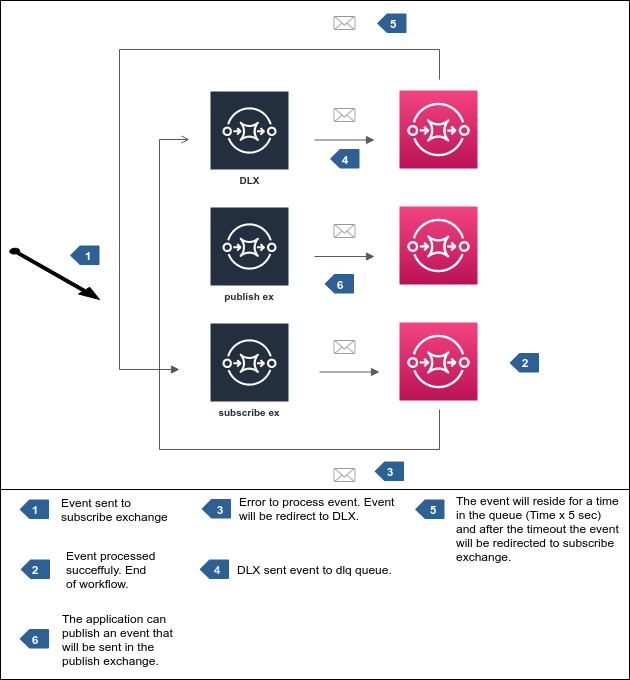

# Publish/Subscribe

## overview



## Usage Example

#### Consumer

```python
import asyncio
import logging

from rabbit.client import AioRabbitClient
from rabbit.publish import Publish
from rabbit.subscribe import Subscribe
from rabbit.task import StandardTask


class Consumer:
    def __init__(self, loop=None):
        logging.getLogger().setLevel(logging.DEBUG)
        self.loop = loop or asyncio.get_event_loop()
        self.subscribe_client = AioRabbitClient()
        self.loop.create_task(self.subscribe_client.persistent_connect())

    async def init(self):
        publish = Publish(self.subscribe_client)
        subscribe = Subscribe(
            client=self.subscribe_client, publish=publish, task=StandardTask()
        )
        await publish.configure()
        await subscribe.configure()

    def run(self):
        self.loop.run_until_complete(self.init())
        self.loop.run_forever()

consumer = Consumer()
consumer.run()
```

### Producer

```python
import asyncio
import json
import os

from rabbit.client import AioRabbitClient
from rabbit.exchange import Exchange
from rabbit.publish import Publish
from rabbit.queue import Queue

PAYLOAD = json.dumps(
    {"document": 1, "description": "123", "pages": ["abc 123", "def 456", "ghi 789"]}
)


class Producer:
    def __init__(self, loop=None, client=None, qtd=1):
        self.loop = loop or asyncio.get_event_loop()
        self.client = client or AioRabbitClient()
        self.qtd = qtd
        self.loop.run_until_complete(self.client.connect())

    def configure_publish(self):
        publish = Publish(
            self.client,
            exchange=Exchange(
                name=os.getenv("SUBSCRIBE_EXCHANGE", "default.in.exchange"),
                exchange_type=os.getenv("SUBSCRIBE_EXCHANGE_TYPE", "topic"),
                topic=os.getenv("SUBSCRIBE_TOPIC", "#"),
            ),
            queue=Queue(name=os.getenv("SUBSCRIBE_QUEUE", "default.subscribe.queue")),
        )
        self.loop.run_until_complete(publish.configure())
        return publish

    def send_event(self):
        publish = self.configure_publish()
        for i in range(0, self.qtd):
            self.loop.run_until_complete(
                publish.send_event(
                    bytes(PAYLOAD, "utf-8")
                    # properties={'headers': {'x-delay': 5000}}
                )
            )

prod = Producer(qtd=1)
prod.send_event()
```
