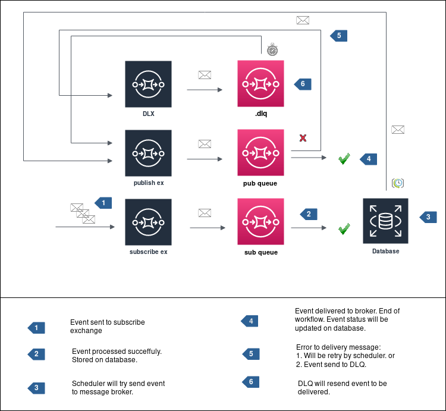

# Polling Publisher



## Pattern

> [https://microservices.io/patterns/data/polling-publisher.html](https://microservices.io/patterns/data/polling-publisher.html)

## Usage Example

### Subscribe & Polling Publisher

```python
import asyncio
import logging

from rabbit.client import AioRabbitClient
from rabbit.polling import PollingPublisher
from rabbit.publish import Publish
from rabbit.subscribe import Subscribe
from rabbit.job import async_echo_job
from rabbit.tlog.db import DB


class PubSub:
    def __init__(self, loop=None):
        logging.getLogger().setLevel(logging.DEBUG)
        self.loop = loop or asyncio.get_event_loop()

    def init_consumer(self):
        subscribe_client = AioRabbitClient()
        self.loop.create_task(subscribe_client.persistent_connect())
        return Subscribe(client=subscribe_client, db=DB(), task=async_echo_job)

    def init_polling_publisher(self):
        polling_client = AioRabbitClient()
        self.loop.create_task(polling_client.persistent_connect())
        publish = Publish(polling_client)
        polling = PollingPublisher(publish)
        return polling, publish

    async def configure_polling_publisher(self, polling, publish, subscribe):
        await publish.configure()
        await subscribe.configure()
        await asyncio.sleep(20)
        await polling.run()

    def run(self):
        polling, publish = self.init_polling_publisher()
        subscribe = self.init_consumer()
        self.loop.run_until_complete(
            self.configure_polling_publisher(polling, publish, subscribe)
        )
        self.loop.run_forever()

pubsub = PubSub()
pubsub.run()
```

### Producer

```python
import asyncio
import json
import os

from rabbit.client import AioRabbitClient
from rabbit.exchange import Exchange
from rabbit.publish import Publish
from rabbit.queue import Queue

PAYLOAD = json.dumps(
    {"document": 1, "description": "123", "pages": ["abc 123", "def 456", "ghi 789"]}
)


class Producer:
    def __init__(self, payload: bytes, qtd: int = 1):
        self.loop = asyncio.get_event_loop()
        self.client = AioRabbitClient()
        self.qtd = qtd
        self.payload = payload
        self.loop.run_until_complete(self.client.connect())

    def configure_publish(self):
        publish = Publish(
            self.client,
            exchange=Exchange(
                name=os.getenv("SUBSCRIBE_EXCHANGE", "default.in.exchange"),
                exchange_type=os.getenv("SUBSCRIBE_EXCHANGE_TYPE", "topic"),
                topic=os.getenv("SUBSCRIBE_TOPIC", "#"),
            ),
            queue=Queue(name=os.getenv("SUBSCRIBE_QUEUE", "default.subscribe.queue")),
        )
        self.loop.run_until_complete(publish.configure())
        return publish

    def send_event(self):
        publish = self.configure_publish()
        for i in range(0, self.qtd):
            self.loop.run_until_complete(
                publish.send_event(
                    self.payload
                    # properties={'headers': {'x-delay': 5000}}
                )
            )

prod = Producer(bytes(PAYLOAD, "utf8"), qtd=1)
prod.send_event()
```
