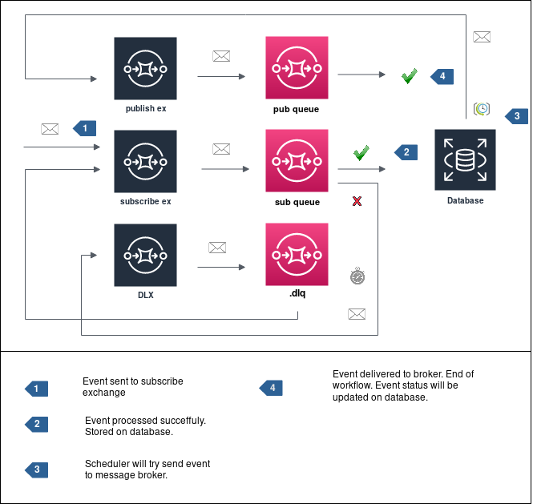

# Polling Publisher

Now this feature is done out-of-the-box.



## Pattern

> [https://microservices.io/patterns/data/polling-publisher.html](https://microservices.io/patterns/data/polling-publisher.html)

## Usage Example

### Subscribe & Polling Publisher

```python
import asyncio
import logging

from rabbit.client import AioRabbitClient
from rabbit.exchange import Exchange
from rabbit.publish import Publish


logging.getLogger().setLevel(logging.DEBUG)

async def init_polling() -> None:
    loop = asyncio.get_running_loop()
    
    client = AioRabbitClient()
    loop.create_task(client.persistent_connect())

    publish = Publish(client=client)
    loop.create_task(publish.configure())
    
    event_repository = EventRepository(publish, DB())
    loop.create_task(event_repository.run_polling())


loop = asyncio.get_event_loop()
loop.run_until_complete(init_polling())
```

### Event Repository

```python
import asyncio


class EventRepository:
    def __init__(self, publish, db):
        self._publish = publish
        self._db = db
    
    async def run_polling(self):
        logger.info("Starting polling-publisher")
        while True:
            await asyncio.sleep(10)
            oldest_event = (
                self._db.session.query(Event)
                .filter(Event.status == False)
                .order_by("created_by")
                .first()
            )
            if oldest_event:
                await self._publish.send_event(oldest_event.body)
                oldest_event.status = True
                self._db.session.commit()
                logger.info("Event sent.")
            else:
                logger.info("No event to be processed.")
```

### Event Model

```python
from datetime import datetime

from sqlalchemy.ext.declarative import declarative_base
from sqlalchemy import Column, Integer, VARCHAR, Boolean, BLOB, TIMESTAMP


Base = declarative_base()

class Event(Base):
    __tablename__ = 'event'

    id = Column(Integer, primary_key=True)
    body = Column(BLOB, nullable=False)
    created_at = Column(TIMESTAMP, nullable=False, default=datetime.utcnow)
    created_by = Column(VARCHAR, nullable=False)
    status = Column(Boolean, nullable=False, default=False)
```
