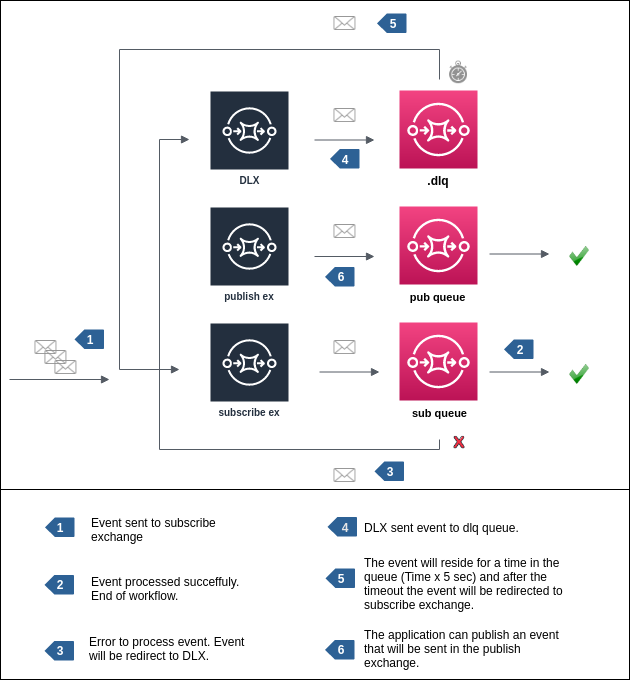

# Publish/Subscribe



## Usage Example

### Consumer

```python
import asyncio
import logging
import os

from aiohttp import web

from rabbit.client import AioRabbitClient
from rabbit.exchange import Exchange
from rabbit.publish import Publish
from rabbit.queue import Queue
from rabbit.subscribe import Subscribe
from rabbit.tlog.event_persist import EventPersist


logging.getLogger().setLevel(logging.DEBUG)
loop = asyncio.get_event_loop()

subscribe_client = AioRabbitClient(loop)
loop.create_task(subscribe_client.persistent_connect())

# publisher
publish = Publish(
    subscribe_client,
    exchange=Exchange(
        name=os.getenv('PUBLISH_EXCHANGE', 'default.out.exchange'),
        exchange_type=os.getenv('PUBLISH_EXCHANGE_TYPE', 'topic'),
        topic=os.getenv('PUBLISH_TOPIC', '#')
    ),
    queue=Queue(
        name=os.getenv('PUBLISH_QUEUE', 'default.publish.queue')
    )
)

# consumer
subscribe = Subscribe(
    client=subscribe_client,
    publish=publish
)


def configure_consumer(app, publish, subscribe):
    app.loop.run_until_complete(publish.configure())
    app.loop.run_until_complete(subscribe.configure())


print(
    "[>] Starting consumer example..."
)
app = web.Application(loop=loop)
configure_consumer(app, publish, subscribe)
web.run_app(app, host='0.0.0.0', port=5000)
```

### Producer

```python
import asyncio
import json
import os

from rabbit.client import AioRabbitClient
from rabbit.exchange import Exchange
from rabbit.publish import Publish
from rabbit.queue import Queue


loop = asyncio.get_event_loop()

client = AioRabbitClient(loop)
loop.run_until_complete(client.connect())

publish = Publish(
    client,
    exchange=Exchange(
        name=os.getenv('SUBSCRIBE_EXCHANGE', 'default.in.exchange'),
        exchange_type=os.getenv('SUBSCRIBE_EXCHANGE_TYPE', 'topic'),
        topic=os.getenv('SUBSCRIBE_TOPIC', '#')
    ),
    queue=Queue(
        name=os.getenv('SUBSCRIBE_QUEUE', 'default.subscribe.queue')
    )
)
loop.run_until_complete(publish.configure())
print(
    "[>] Event sent to: "
    f"[exchange: {os.getenv('SUBSCRIBE_EXCHANGE', 'default.in.exchange')}"
    f" | topic: {os.getenv('SUBSCRIBE_TOPIC', '#')} | "
    f"subscribe: {os.getenv('SUBSCRIBE_QUEUE', 'default.subscribe.queue')}]"
)

payload = {
    'document': 1,
    'description': '123',
    'pages': [
        {'body': 'abc 123'},
        {'body': 'def 456'},
        {'body': 'ghi 789'}
    ]
}

loop.run_until_complete(
    publish.send_event(
        bytes(json.dumps(payload), 'utf-8')
        # properties={'headers': {'x-delay': 5000}}
    )
)
```
