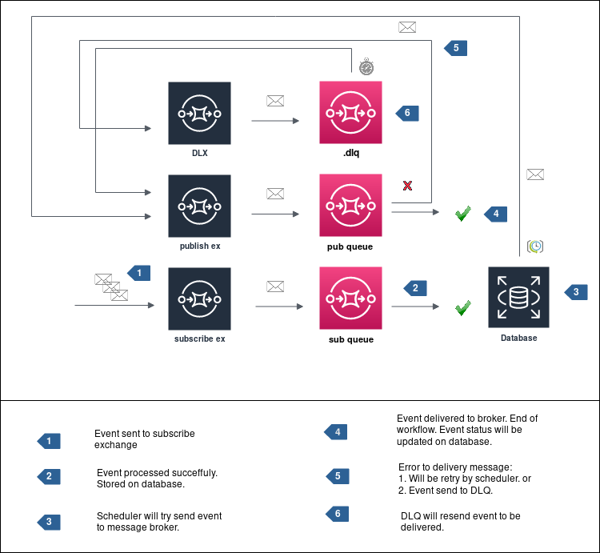

# Polling Publisher

!!! info ""
    From the version 1.x this feature is supported out-of-box.



## Pattern

> [https://microservices.io/patterns/data/polling-publisher.html](https://microservices.io/patterns/data/polling-publisher.html)

## Usage example

``` py linenums="1" title="subscribe-polling-publisher.py"
import asyncio
import logging

from rabbit import AioRabbitClient, Publish


logging.getLogger().setLevel(logging.DEBUG)


class MyRepo:
    def __init__(self, publish, db):
        self._publish = publish
        self._db = db

    async def start_polling(self):
        while True:
            await asyncio.sleep(10)
            # do some work here and retrieve database event data.
            event = b'{"key": "value"}'
            await self._publish.send_event(event)


async def main():
    client = AioRabbitClient()
    await client.connect(host="localhost", port=5672)
    channel = await client.channel()

    publish = Publish()
    publish.channel = channel

    repo = MyRepo(publish, None)  # pass your database connection here
    asyncio.create_task(repo.start_polling())
    await asyncio.Event().wait()


asyncio.run(main())
```
