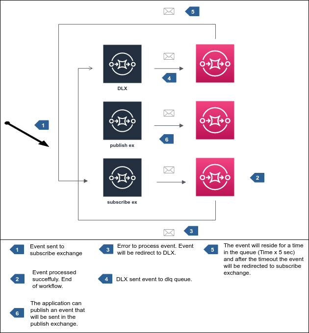

# Publisher-Subscriber

## workflow



## Usage Example

!!! info ""

    All code examples can be used in the python asyncio REPL, for this use: `python -m asyncio` available on python >= 3.8.

#### Consumer

```py linenums="1" title="consumer-example.py"
import asyncio
import logging

from rabbit import AioRabbitClient, Exchange, Queue, Subscribe
from rabbit.job import async_echo_job


logging.basicConfig(level=logging.INFO)


async def main():
    client = AioRabbitClient()
    await client.connect(host="localhost", port=5672)
    channel = await client.channel()

    subscribe = Subscribe(
        task=async_echo_job,
        exchange=Exchange(name="default.in.exchange", exchange_type="topic", topic="#"),
        queue=Queue(name="default.subscribe.queue"),
        concurrent=5,
    )
    await subscribe.configure(channel)

    # run forever
    await asyncio.Event().wait()


asyncio.run(main())
```

### Publisher

#### CLI
```bash
python -m rabbit send-event data.json
```

#### Code

``` py linenums="1" title="publisher-example.py"
import asyncio
import logging

from rabbit import AioRabbitClient, Publish


logging.basicConfig(level=logging.INFO)


async def main():
    client = AioRabbitClient()
    await client.connect(host="localhost", port=5672)
    channel = await client.channel()

    publish = Publish()
    publish.channel = channel
    await publish.send_event(
        b'{"document": 1, "description": "123", "pages": ["abc", "def", "ghi"]}'
    )


asyncio.run(main())
```

!!! note "Publisher confirms"
    Publisher confirms are enabled by default by `aio-pika` on every channel. No explicit configuration is needed. If you need to disable them (rare — e.g., transaction channels), use the aio-pika API directly.
